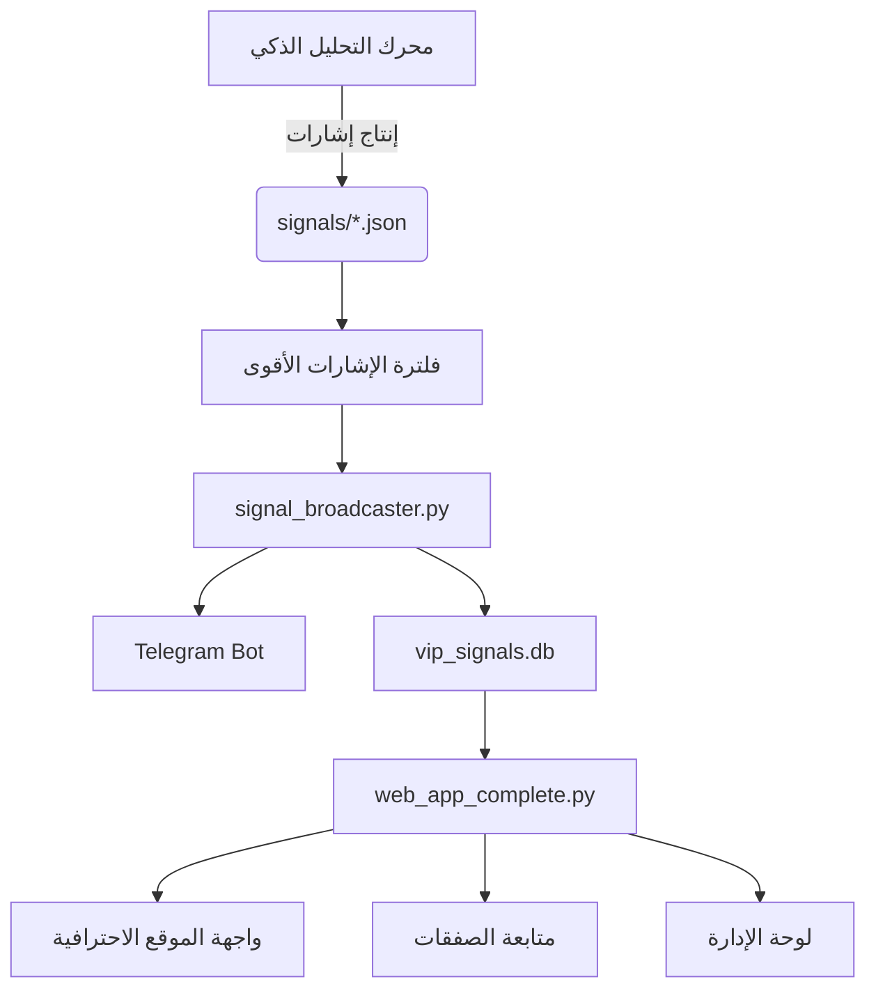
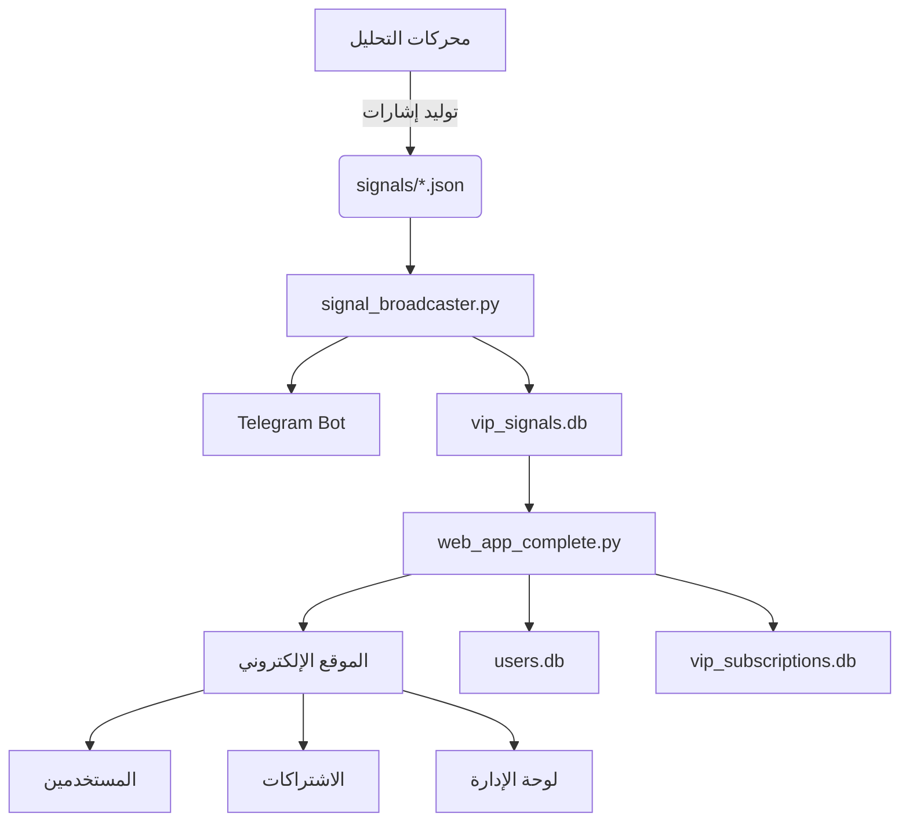

# النظام الموحد للتداول والتقارير
## Unified Trading & Reporting System

نظام متكامل لإدارة الصفقات وتوليد التقارير الدورية مع تركيز على الإحصائيات التفصيلية.

---

## 🌟 المميزات الرئيسية

### 📊 إحصائيات متقدمة
- تتبع دقيق للصفقات الرابحة والخاسرة
- حساب معدل النجاح (Win Rate)
- عامل الربح (Profit Factor)
- متوسط الربح/الخسارة
- أفضل وأسوأ صفقة
- إحصائيات حسب العملة
- إحصائيات حسب الاستراتيجية

### 📅 تقارير دورية تلقائية
1. **التقرير اليومي** - يومياً الساعة 23:00
   - ملخص الأداء اليومي
   - الصفقات المفتوحة
   - توصيات ذكية

2. **التقرير الأسبوعي** - كل يوم أحد الساعة 22:00
   - ملخص الأداء الأسبوعي
   - الأداء اليومي خلال الأسبوع
   - أفضل أزواج العملات
   - تحليل الأداء والتحسينات

3. **التقرير الشهري** - أول كل شهر الساعة 00:00
   - ملخص شامل للشهر
   - ترتيب أزواج العملات
   - أداء الاستراتيجيات
   - تحليل الاتجاهات
   - أهداف الشهر القادم

### 💼 إدارة الصفقات
- إضافة صفقات جديدة
- تتبع 3 مستويات لجني الأرباح (TP1, TP2, TP3)
- حساب نسبة المخاطرة للعائد (Risk:Reward)
- إغلاق الصفقات مع حساب تلقائي للربح/الخسارة
- عرض الصفقات المفتوحة

### 🗄️ قاعدة بيانات متقدمة
- SQLite لتخزين جميع البيانات
- جدول الصفقات (trades)
- جدول الملخصات اليومية (daily_summary)
- تصدير البيانات إلى JSON

---

## 🚀 التشغيل السريع

### الطريقة الأولى: ملف BAT
انقر نقراً مزدوجاً على:
```
START_UNIFIED_SYSTEM.bat
```

> **ملاحظة:** إذا كنت تستخدم PowerShell، يجب تشغيل ملف السيرفر باستخدام:
> ```powershell
> .\START_WEB_SERVER.bat
> ```
> وذلك لأن PowerShell لا ينفذ ملفات الدُفعة من المسار الحالي إلا بهذه الطريقة.

### الطريقة الثانية: سطر الأوامر
```bash
cd "D:\GOLD PRO"
.venv\Scripts\activate
python unified_trading_system.py
```
---

## النظام المتكامل والاحترافي للإشارات

### 1. إنتاج إشارات احترافية
- استخدام خوارزميات تحليل متقدمة (مؤشرات فنية، ذكاء اصطناعي) لتوليد إشارات دقيقة.
- مراقبة جميع الأزواج المتاحة تلقائياً.
- حساب نقاط الدخول المثالية بناءً على السيولة والتقلب والمؤشرات.

### 2. نقاط جني الأرباح الذكية
- تحديد TP1/TP2/TP3 بناءً على مستويات الدعم/المقاومة وتحليل الحركة.
- استخدام trailing stop لمتابعة الربح تلقائياً.

### 3. بث أقوى الإشارات بسرعة
- تصنيف الإشارات حسب القوة (strong, medium, weak).
- بث الإشارات الأقوى فقط للمشتركين فور توليدها.
- مراقبة مجلد signals/ بشكل لحظي.

### 4. متابعة الصفقات بشكل احترافي
- تسجيل حالة كل صفقة في vip_signals.db (مفتوحة، مغلقة، تحقق TP/SL).
- تحديث الحالة تلقائياً عند تحقق أي هدف أو وقف خسارة.
- إرسال تحديثات تلقائية للمشتركين عند تحقق TP أو SL.

### 5. واجهة الموقع الاحترافية
- صفحة رئيسية تعرض أقوى الإشارات بشكل مباشر.
- صفحة متابعة الصفقات تعرض حالة كل صفقة وتحديثاتها.
- لوحة تحكم للإدارة لمتابعة الأداء، الإشارات، المستخدمين.

### 6. مثال تدفق برمجي احترافي


### 7. خطوات التنفيذ البرمجي
- تطوير محرك التحليل ليشمل جميع الأزواج ويصنف الإشارات حسب القوة.
- تحسين broadcaster ليبث الإشارات الأقوى فوراً ويحدث حالة الصفقة.
- تطوير الموقع ليعرض الإشارات الأقوى ويتيح متابعة الصفقات وتحديثاتها.

النظام بهذا الشكل يضمن أفضل أداء، سرعة بث، ودقة متابعة لجميع الصفقات.

---

## ⌨️ الأوامر المتاحة

بعد تشغيل النظام، يمكنك استخدام الأوامر التالية:

### 📊 التقارير
- `report daily` - توليد التقرير اليومي
- `report weekly` - توليد التقرير الأسبوعي
- `report monthly` - توليد التقرير الشهري
- `report all` - توليد جميع التقارير دفعة واحدة

### 📈 الإحصائيات
- `stats` - عرض الإحصائيات (آخر 30 يوم)
- `trades` - عرض الصفقات المفتوحة

### 💼 إدارة الصفقات
- `add` - إضافة صفقة جديدة
- `close` - إغلاق صفقة

### 📤 التصدير والإيقاف
- `export` - تصدير البيانات إلى JSON
- `help` - عرض المساعدة
- `quit` أو `exit` - إيقاف النظام

---

## 📋 أمثلة على الاستخدام

### إضافة صفقة جديدة

```
> add

📝 إضافة صفقة جديدة
============================================================
العملة (مثال: XAUUSD): XAUUSD
الاتجاه (buy/sell): buy
سعر الدخول: 2650.50
وقف الخسارة: 2640.00
الهدف الأول TP1: 2660.00
الهدف الثاني TP2: 2670.00
الهدف الثالث TP3: 2680.00
حجم الصفقة (lot): 1.0
الاستراتيجية (مثال: ICT): ICT
الإطار الزمني (مثال: 1H): 1H
ملاحظات (اختياري): صفقة ممتازة بناءً على OB

✅ تم إضافة الصفقة #1 بنجاح!
📊 نسبة المخاطرة للعائد: 1:2.86
```

### إغلاق صفقة

```
> close

💼 الصفقات المفتوحة
============================================================
📈 الصفقة #1 - XAUUSD BUY
  💵 الدخول: 2650.50000
  🛑 وقف الخسارة: 2640.00000
  🎯 TP1: 2660.00000 | TP2: 2670.00000 | TP3: 2680.00000
  ⏰ الوقت: 2026-01-24 10:30:00
  📊 ICT | 1H

رقم الصفقة المراد إغلاقها: 1
سعر الخروج: 2670.00
ملاحظات (اختياري): وصلت TP2

✅ تم إغلاق الصفقة #1
💰 النتيجة: $19.50 (0.74%)
📊 الحالة: WIN
```

### عرض الإحصائيات

```
> stats

============================================================
📊 إحصائيات آخر 30 يوم
============================================================
✅ إجمالي الصفقات: 45
🎯 الصفقات الرابحة: 32 (71.11%)
❌ الصفقات الخاسرة: 13
⚖️  صفقات التعادل: 0

💰 الربح الإجمالي: $1,250.00
💸 الخسارة الإجمالية: $420.00
📊 صافي الربح: $830.00

⚖️  عامل الربح: 2.98
💹 متوسط الربح: $39.06
📉 متوسط الخسارة: $32.31
🌟 أفضل صفقة: $125.00
⚠️  أسوأ صفقة: -$85.00
```

---

## 📁 هيكل الملفات

```
D:\GOLD PRO\
├── unified_trading_system.py      # النظام الرئيسي
├── trade_statistics.py            # محرك الإحصائيات
├── periodic_reports.py            # مولد التقارير
├── trades_database.db             # قاعدة البيانات
├── START_UNIFIED_SYSTEM.bat       # ملف التشغيل
└── reports/                       # مجلد التقارير
    ├── daily_report_20260124.txt
    ├── weekly_report_W4_2026.txt
    └── monthly_report_2026_01.txt
```

---

## 🗄️ قاعدة البيانات

### جدول الصفقات (trades)
```sql
- id: رقم الصفقة
- symbol: العملة (XAUUSD, EURUSD, etc.)
- direction: الاتجاه (buy/sell)
- entry_price: سعر الدخول
- exit_price: سعر الخروج
- stop_loss: وقف الخسارة
- take_profit_1, 2, 3: الأهداف
- entry_time: وقت الدخول
- exit_time: وقت الخروج
- status: الحالة (open/win/loss/break_even)
- profit_loss: الربح/الخسارة
- profit_percentage: نسبة الربح/الخسارة
- volume: حجم الصفقة
- strategy: الاستراتيجية
- timeframe: الإطار الزمني
- risk_reward_ratio: نسبة المخاطرة للعائد
- notes: ملاحظات
```

### جدول الملخصات اليومية (daily_summary)
```sql
- date: التاريخ
- total_trades: إجمالي الصفقات
- winning_trades: الصفقات الرابحة
- losing_trades: الصفقات الخاسرة
- total_profit: الربح الإجمالي
- total_loss: الخسارة الإجمالية
- net_profit: صافي الربح
- win_rate: معدل النجاح
- avg_win: متوسط الربح
- avg_loss: متوسط الخسارة
- profit_factor: عامل الربح
- best_trade: أفضل صفقة
- worst_trade: أسوأ صفقة
```

---

## 📊 مثال على التقرير اليومي

```
╔══════════════════════════════════════════════════════════════╗
║              📊 التقرير اليومي للتداول                      ║
║              Daily Trading Report                             ║
╚══════════════════════════════════════════════════════════════╝

📅 التاريخ: 2026-01-24
⏰ الوقت: 23:00:00

═══════════════════════════════════════════════════════════════

📈 ملخص الأداء اليومي
━━━━━━━━━━━━━━━━━━━━━━━━━━━━━━━━━━━━━━━━━━━━━━━━━━━━━━━━━━━
✅ إجمالي الصفقات: 3
🎯 الصفقات الرابحة: 2 (66.67%)
❌ الصفقات الخاسرة: 1
⚖️  صفقات التعادل: 0

💰 الربح الإجمالي: $85.00
💸 الخسارة الإجمالية: $25.00
📊 صافي الربح: $60.00

═══════════════════════════════════════════════════════════════

📊 مؤشرات الأداء الرئيسية (KPIs)
━━━━━━━━━━━━━━━━━━━━━━━━━━━━━━━━━━━━━━━━━━━━━━━━━━━━━━━━━━━
🎯 معدل النجاح (Win Rate): 66.67%
💹 متوسط الربح: $42.50 (1.60%)
📉 متوسط الخسارة: $25.00 (0.94%)
⚖️  عامل الربح (Profit Factor): 3.40
🌟 أفضل صفقة: $50.00
⚠️  أسوأ صفقة: -$25.00
```

---

## 🔧 المتطلبات

### المكتبات المطلوبة
```bash
pip install schedule
```

### Python Version
- Python 3.7 أو أحدث

---

## 🎯 الميزات القادمة

---

## 📞 الدعم

للمساعدة أو الاستفسارات:
- البريد الإلكتروني: mahmoodalqaise750@gmail.com

## خطة الربط بين جميع المزايا

### 1. توحيد إنتاج الإشارات
- جميع محركات التحليل (analysis_engine.py، recommendations_engine.py، وغيرها) تكتب إشاراتها بصيغة موحدة في مجلد signals/.
- يجب التأكد من توافق الحقول (symbol، direction، entry، sl، tp1..tp3) مع ما يتوقعه signal_broadcaster.py.

### 2. البوت الموحد لإرسال الإشارات
- signal_broadcaster.py يقرأ جميع إشارات signals/*.json ويحسب معرف ثابت لكل إشارة ويمنع التكرار.
- يستخدم bots_config.json لإدارة إعدادات البوتات دون أسرار صلبة.
- يرسل الإشارات للمشتركين حسب بياناتهم في vip_subscriptions.db.

### 3. الموقع الإلكتروني المتكامل
- web_app_complete.py هو المدخل الرئيسي لعرض الإشارات وإدارة المستخدمين والاشتراكات.
- يعتمد على قواعد البيانات:
   - vip_signals.db: إشارات اليوم.
   - users.db: حسابات المستخدمين وصلاحياتهم.
   - vip_subscriptions.db: بيانات الاشتراكات.
- يوفر لوحة تحكم للإدارة لمتابعة الأداء وإدارة الإشارات والمستخدمين.

### 4. تدفق البيانات والمزايا


### 5. خطوات الربط العملي
- توحيد صيغة الإشارات في جميع محركات التحليل.
- ضبط broadcaster ليقرأ ويرسل جميع الإشارات.
- ربط الموقع بقواعد البيانات الثلاثة.
- تفعيل لوحة الإدارة لمتابعة الإشارات والمستخدمين.
- دعم تعدد البوتات عند الحاجة.

يمكن البدء بتنفيذ أي جزء من الربط حسب الأولوية المطلوبة.


2. **التقارير**: يتم حفظ التقارير في مجلد `reports/` بصيغة نصية قابلة للقراءة.

3. **التصدير**: يمكنك تصدير جميع البيانات إلى JSON باستخدام أمر `export`.

4. **الجدولة**: التقارير الدورية تعمل تلقائياً في الخلفية طالما البرنامج يعمل.

---

## 🌟 نصائح للاستخدام الأمثل

1. أضف الصفقات فوراً بعد فتحها
2. أغلق الصفقات فوراً بعد إغلاقها
3. راجع التقارير اليومية بانتظام
4. استخدم الملاحظات لتوثيق قرارات التداول
5. تابع الإحصائيات لتحسين الأداء

---

**🚀 نتمنى لك تداولاً موفقاً!**
